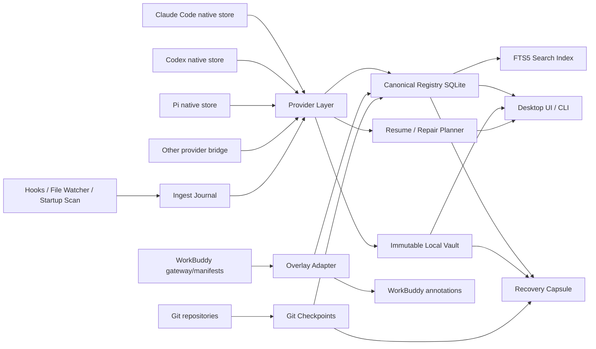

# AgentVault：跨 Coding Agent Session 管理、备份与灾难恢复系统

> 一份可直接进入开发的产品与技术方案  
> 研究日期：2026-09-04  
> 工作名称：`AgentVault`，后续可重命名  
> 首要支持：Codex、Claude Code、Pi、WorkBuddy  
> 推荐技术栈：Tauri 2 + React + TypeScript + Rust + SQLite

---

## 0. 最终裁决

### 0.1 一句话结论

**以 `cc-sessions` 为可运行底座进行 fork，保留其成熟的本地会话管理、原子写入、备份恢复、路径安全和 Codex 修复代码；将内部重构为 Provider SDK；用 `pi-session-manager` 的 `casr` 设计补全跨 Agent 归一化与恢复能力；用 `agent-history` 补全多环境发现、路径别名和远程同步；借鉴 Tutti 的 SessionGraph/权威边界，以及 Omnigent 的能力注册和运行时生命周期；首版只做“保住、找到、原生续聊、跨 Agent 接棒”，不要先做一套新的 Agent 运行平台。**

### 0.2 推荐组合

| 层 | 推荐来源 | 使用方式 |
|---|---|---|
| 桌面壳、CLI、现有功能 | `cc-sessions` | **直接 fork，作为工程底盘** |
| 原子文件、补偿事务、备份恢复 | `cc-sessions` | **直接复用并抽成通用 Rust crate** |
| Provider trait、Canonical Session、跨格式适配 | `pi-session-manager/casr` | **可直接移植并保留 MIT 署名，建议抽成独立 crate 降低耦合** |
| 多环境扫描、SSH/WSL、路径别名、轻量导出 | `agent-history` | **迁移算法与测试样例，不照搬单文件架构** |
| SessionGraph、父子会话、Turn 生命周期、能力快照 | Tutti | **借领域模型和 ADR，不整体 fork** |
| Harness 能力矩阵、插件注册、进程生命周期 | Omnigent | **借接口和小模块，不整体 fork** |
| 搜索演进 | CASS | v0.2 借鉴 BM25、派生索引、混合检索 |
| 活跃 Agent 管理 | Agent Deck | v0.2 借鉴 tmux、状态探测、worktree |
| 云备份 | SessionVault | v0.3 借鉴机器命名空间、增量包、R2、加密 |
| macOS 交互参考 | Agent Sessions | 借鉴统一搜索、恢复箱、图片预览和一键 Resume |

### 0.3 产品边界

首版产品只承诺四件事：

1. **保住**：原生 Session 一旦被发现，就进入不可变本地 Vault，并且可校验。
2. **找到**：即使原生列表、索引、provider 过滤或 cwd 失效，仍可搜索到。
3. **续聊**：优先调用原 Agent 的原生 resume/fork，在正确项目目录恢复。
4. **接棒**：原生 resume 失败时，生成 Recovery Capsule，让 Codex、Claude Code、Pi 或其他 Agent 在新 Session 中接着做。

首版明确不做：

- 不重写 Codex、Claude Code、Pi 本身的 Agent loop。
- 不把所有 Agent 强制运行在 AgentVault 内。
- 不把 Claude Session 伪造成 Codex 原生 Session。
- 不做多用户协作、手机控制、企业权限中心。
- 不先做向量搜索、云同步或复杂编排。
- 不把 SQLite 搜索索引当作唯一备份。

---

## 1. 为什么这不是一个普通的 History Viewer

### 1.1 真实丢失模型

Session “丢失”至少有十种不同含义：

| 失败类型 | 实际情况 | AgentVault 应对 |
|---|---|---|
| 自动清理 | 原生 transcript 被保留策略删除 | 提前进入 Vault；显示保留风险 |
| 索引失配 | 文件仍在，但原生 picker 看不到 | 独立扫描原始文件和 SQLite；健康诊断 |
| provider/profile 过滤 | 切换 provider 后旧 Session 隐藏 | 独立于当前 provider 的统一发现 |
| cwd 移动 | 项目改名、移动、worktree 变化 | Project 与 ProjectLocation 分离；路径映射 |
| JSONL 损坏 | 首行、尾行或中间记录不完整 | 宽容解析、原始行保留、降级可见、修复预案 |
| 崩溃未落盘 | Agent 进程退出前没有形成可恢复文件 | Hook/Flight Recorder；未见 native 文件时告警 |
| 升级不兼容 | 新版本不认旧 metadata/schema | 保存原始快照、解析器版本、恢复胶囊 |
| 大 Session 无法加载 | picker 卡死、内存峰值、附件过大 | 自己分页读取；直接 ID resume；胶囊续接 |
| 误删或错误修复 | 用户或第三方工具修改了原文件 | 所有写操作前快照；CAS；补偿事务 |
| 代码现场已漂移 | 聊天恢复了，但代码状态不在 | GitCheckpoint 与 Session 绑定 |
| 多机分散 | Mac、本地服务器、WSL 各有一份 | Machine/SourceInstance 身份；后续远程同步 |
| 聚合器重复 | WorkBuddy 与底层 Claude/Codex 重复导入 | 以 native identity 去重，WorkBuddy 作为 overlay |

Claude Code 官方文档显示，transcript、tool result 和 file history 都会按照 `cleanupPeriodDays` 清理，默认值是 30 天；这些数据还是明文存储，`claude project purge` 会删除项目的 transcript、file-history 等状态。[^claude-dir] Codex 的公开 issue 也持续出现“文件仍在但列表不可见”“provider 切换后隐藏”“索引损坏”“旧版本 metadata 不兼容”“大 Session resume 卡顿”以及“崩溃后 rollout 根本没有落盘”等不同故障。[^codex-index-stale][^codex-provider-hide][^codex-bad-json][^codex-no-rollout][^codex-large]

### 1.2 一个必须正视的盲点

**如果原 Agent 从未把 Session 写到磁盘，单纯扫描文件无法救回它。**

因此系统要提供两种运行模式：

- **Passive Mode，默认**：扫描原生文件、SQLite、索引、sidecar 和 Hook 事件，不改变用户启动 Agent 的方式。
- **Managed Flight Recorder，可选**：由 AgentVault 或 tmux/PTY 启动 Agent，额外记录进程身份、cwd、终端输出、用户提交和 provider 事件。即使 native session 未落盘，至少保住一个可审计的恢复记录。

v0.1 先把 Passive Mode 做稳；v0.2 加 Flight Recorder。对于已经使用 WorkBuddy 的 Claude/Codex Session，可以优先消费 WorkBuddy 的 Hook manifest 和 canonical transcript provider，降低 Flight Recorder 的缺口。[^workbuddy-harness][^workbuddy-session]

---

## 2. 产品定义

### 2.1 核心承诺

> 只要一个 Session 曾经被 AgentVault 成功 checkpoint，即使原生 picker 看不到、项目路径移动、索引损坏、CLI 升级或原文件后来被清理，用户仍然能找到原始记录、验证备份，并尽可能原生恢复；无法原生恢复时，至少能在任意 Agent 中带着准确现场继续。

### 2.2 五个核心使用场景

#### 场景 A：快速找到昨天的工作

用户搜索“Runtime Session Binding”，系统跨 Claude Code、Codex、Pi、WorkBuddy 返回：

- 原始 Agent 和 native session ID
- 项目、分支、cwd
- 首条任务、最后状态
- 时间、模型、工具调用
- 快照状态与健康状态
- `Resume`、`Open Transcript`、`Recovery Capsule`

#### 场景 B：原生 Session 从列表消失

AgentVault 检测到：

- native 文件存在
- 原生索引缺失或不一致
- native ID 仍可直接 resume

界面显示：

> “会话正文存在，但 Codex 索引不可见。建议先验证快照，再尝试直接 Resume；必要时执行索引修复。”

#### 场景 C：项目目录移动

原 Session cwd 是：

```text
/Users/minolta/Projects/Swordfish
```

当前项目已移动到：

```text
/Users/minolta/Code/Swordfish
```

AgentVault 不修改 Session 身份，而是：

1. 识别同一 Git 项目。
2. 新增 `ProjectLocation`。
3. Resume 时提供旧路径、当前路径和用户映射。
4. 仅在 provider 明确支持时修改 native cwd/index。
5. 修改前强制建立 checkpoint。

#### 场景 D：原生恢复失败

系统生成：

```text
Recovery Capsule
├─ 原目标
├─ 最后有效用户请求
├─ 已完成事项
├─ 关键决策
├─ Git 状态
├─ 改动文件
├─ 失败工具调用
├─ 未解决问题
├─ 下一步建议
└─ 原始 Session/快照证据
```

然后让用户选择：

- 在 Claude Code 中新开 Session
- 在 Codex 中新开 Session
- 在 Pi 中新开 Session
- 仅复制胶囊
- 导出 Markdown/JSON

#### 场景 E：同一项工作跨多个 Agent

```text
WorkSession: Runtime Session Binding

├─ Claude Code A：方案与第一轮实现
├─ Codex B：独立审查
├─ Claude Code C：修复
└─ Pi D：小型验证实验
```

`WorkSession` 是 AgentVault 自己的组织对象，不冒充任何 provider 的 native session。

---

## 3. 五个指定开源项目的技术裁决

## 3.1 `ccpopy/cc-sessions`

### 适合承担什么

它是五个指定项目中最适合作为**直接工程底盘**的项目：

- Tauri 2 + React + TypeScript + Rust。
- 已支持 Codex、Claude Code、OpenCode、Cursor。
- 已有会话浏览、正文搜索、预览、备份恢复、路径迁移、索引修复、Markdown 导出、CLI、Web UI。
- 使用 MIT License，最适合 fork 后继续开放源码。[^cc-sessions]

### 最有价值的代码

| 文件/模块 | 价值 | 复用裁决 |
|---|---|---|
| `src-tauri/src/atomic_file.rs` | SHA-256 指纹、同目录临时文件、fsync、CAS、原子替换、no-replace rename | **直接抽成 `vault-io`，高复用** |
| `src-tauri/src/mutation_journal.rs` | 文件、SQLite、项目状态的补偿事务与逆序回滚 | **直接复用并去 Codex 专用耦合** |
| `src-tauri/src/path_safety.rs` | 防路径逃逸、符号链接、Windows reparse/junction | **直接复用** |
| `src-tauri/src/backup.rs` | manifest、hash、provider 文件集合、恢复校验 | **抽取通用骨架，保留 Codex 专用实现** |
| `src-tauri/src/backup/restore_snapshot.rs` | 恢复前状态捕获和失败回滚 | **直接抽取** |
| `src-tauri/src/bundle.rs`、`bundle/zip_archive.rs` | 可迁移会话包 | **直接复用后升级 schema** |
| `src-tauri/src/claude_sessions.rs` | Claude 扫描、标题选择、sidecar、subagent、cwd | **迁入 Claude Provider** |
| `src-tauri/src/sessions.rs` | Codex SQLite/索引/rollout 合并、归档补扫 | **拆分为 Codex Provider 和 Registry Service** |
| `src-tauri/src/codex_projects/*` | Codex state/index/project 修复 | **保留为 provider-specific repair** |
| `src-tauri/src/rollout.rs` | Codex JSONL 读取与统计 | **迁入 Codex Provider** |
| `src-tauri/src/opencode_sessions.rs` | OpenCode 支持 | **v0.1.1 保留** |
| `src-tauri/src/content_search.rs` | 现成全文检索入口 | **alpha 先用，随后替换为统一 FTS5** |
| `src-tauri/src/markdown_export.rs` | 可读导出 | **直接复用，改为 canonical event 输入** |
| `src-tauri/src/lib.rs` 和 Tauri commands | 已有桌面命令面 | **保留 UI 壳，逐步变薄** |

`atomic_file.rs` 会在替换前重新比较文件指纹，防止 Agent 正在追加 JSONL 时被管理器覆盖；`mutation_journal.rs` 会记录每一步补偿并在失败时逆序恢复；`backup.rs` 对恢复源做身份、路径和 SHA-256 校验。这三块是本项目最值得直接继承的“防自伤装甲”。[^cc-atomic][^cc-journal][^cc-backup]

### 不应原样保留的部分

- 当前 provider 分支较多地散落在 service 函数中。
- `SessionSummary` 偏列表模型，不够表达完整事件、分支和 provenance。
- 部分转换、编辑功能过早进入产品核心。
- “修改原生 Session”与“只读索引/备份”边界需要进一步隔离。
- 搜索、备份、恢复、修复尚未统一到 capability contract。

### 结论

**Fork 它，但第一阶段先重构内核，不要继续向单体 `lib.rs + commands` 叠功能。**

---

## 3.2 `Dwsy/pi-session-manager`

### 适合承担什么

PSM 的价值不只是界面，而是 `cross_agent_session_resumer`，即 `casr`：

- Provider trait。
- Canonical Session/Message/Tool Call 模型。
- provider 发现、路径识别、歧义检测。
- native read/write/resume。
- 大量 provider 实现与真实格式 fixture。
- Desktop、CLI、Headless HTTP/WebSocket 多种运行形态。[^psm]

其 Provider trait 已覆盖 `detect`、`session_roots`、`owns_session`、`read_session`、`write_session`、`resume_command`、`list_sessions` 等关键能力；canonical 模型保留 provider、workspace、时间、messages、tool calls/results、extra 和 source path。[^psm-provider][^psm-model]

### 最大问题：工程耦合与许可证确认

PSM 当前 README 明确写的是 MIT，因此不存在此前假设的 LGPL 静态链接问题。它的 Provider trait、canonical IR 和 provider 实现可以直接移植或以 crate 方式复用，但仍应保留原作者版权声明、MIT 许可文本和来源 commit。需要注意的是，GitHub 仓库元数据当前没有识别到根级许可证文件，因此发布前应对选定 commit 再做一次许可证核验，最好推动上游补齐标准 `LICENSE` 文件。

推荐处理方式：

1. **首选：提取为独立 MIT crate**
   - 建立 `agentvault-provider-casr-compat`。
   - 保留上游版权、MIT notice、来源 commit 和修改记录。
   - 先只启用 Claude Code、Codex、Pi 三个经过本机 fixture 验证的 provider。
2. **核心 provider 逐步收敛**
   - 将最关键的 Claude/Codex/Pi provider 迁入 AgentVault 的统一 Provider SDK。
   - 每次迁移都用真实脱敏 fixture、round-trip 和故障注入测试锁定行为。
3. **保留外部 provider 进程协议**
   - 它不再是复用 PSM 的必需条件。
   - 仍用于不同语言、GPL/强 copyleft 插件、实验 provider 和崩溃隔离。

### 结论

**`casr` 可以作为 AgentVault 最重要的直接复用来源之一。法律上按 MIT 保留署名，工程上仍要先隔离成 crate，避免把 PSM 的 UI、网络服务和 provider 细节重新揉成新单体。**

---

## 3.3 `kvsankar/agent-history`

### 适合承担什么

它是一个非常清楚的轻量参考实现：

- 单文件 Python CLI。
- Claude Code、Codex、Gemini CLI、Pi。
- 本地、Windows、WSL、SSH 多环境。
- workspace alias。
- 增量导出。
- SQLite metrics。
- 原始数据只读。[^agent-history]

### 可迁移内容

- source/home/workspace 两维 scope 模型。
- Claude 编码路径、Codex cwd、Gemini hash 的工作区解析思路。
- SSH/rsync 和本地缓存布局。
- 路径改名后的 alias 与 closest-match 提示。
- 基于 mtime 的增量扫描和并行任务。
- Markdown/HTML 导出规则。
- 各 provider 格式文档与 fixture。

### 不适合作为底盘的原因

- 约 1 个超大 Python 入口文件，职责集中。
- 没有可靠恢复事务。
- 不负责 live session、原生修复或不可变 Vault。
- 与目标 Rust/Tauri 共享内核不匹配。

### 结论

**移植算法、格式说明和测试，不移植单文件架构。**

---

## 3.4 `tutti-os/tutti`

### 适合承担什么

Tutti 是完整的多 Agent 工作空间与协作控制面，边界远大于本项目。它最值得借鉴的是：

- `Session`、`Turn`、`Interaction` 的分离。
- `RootAgentSessionID`、父 Session、父 Turn、父 ToolCall 的 lineage。
- `ProviderSessionID` 与产品 Session ID 分离。
- `Resumable`、`LifecycleCapabilities`、`ForkedFrom`。
- `SessionIsolation` 中的 worktree、branch、base commit。
- active turn 不直接塞在 Session 状态里，Turn 自己持有 phase/outcome。
- snapshot authority 和 startup recovery 的 ADR。[^tutti][^tutti-session]

### 为什么不整体 fork

- TypeScript + Go 大型 monorepo。
- 包含运行时、连接器、协作、权限、工作区、同步等大量非目标能力。
- 直接裁剪会比在 cc-sessions 上重构更慢。
- 它解决“运行和协作”，当前项目优先解决“保存和恢复”。

### 结论

**借领域合同和状态机，不借产品壳。**

---

## 3.5 `omnigent-ai/omnigent`

### 适合承担什么

Omnigent 的 `harness_plugins.py` 把 identity、behavior 和 capability 分开：

- `NativeCodingAgent` 只保存稳定身份。
- `NativeHarnessProvider` 保存生命周期 hook 的导入路径。
- `HarnessContribution` 声明 alias、安装方式、capability。
- capability 细分 integration mode、resume、fork history、auth、elicitation、interrupt、streaming、subagents。
- 行为按需懒加载，避免注册表初始化时加载整个 runtime。[^omnigent][^omnigent-registry]

### 可借鉴内容

- Provider descriptor 与 provider implementation 分离。
- capability 必须声明，不能靠 UI 猜。
- `warm reattach`、native resume、rebuild/preamble fork 等差异化语义。
- 插件加载错误不阻塞其他 provider。
- 进程中断、stop、zombie 清理和 bounded probe。

### 为什么不整体 fork

- 它是 Python meta-harness 和编排运行时。
- 项目目标并不是取代 Agent CLI。
- 将其裁剪为 Session Vault 会带入大量策略、sandbox、server 和 runner 复杂度。

### 结论

**借 capability vocabulary、插件 seam 和进程生命周期。**

---

## 4. 额外开源调研结论

### 4.1 CASS

CASS 展示了成熟的跨 Agent 搜索架构：

- 原始来源进入 canonical archive。
- SQLite/Archive 是可重建索引的上游。
- Tantivy BM25 负责精确与代码搜索。
- 语义索引是异步增强。
- Hybrid 使用 RRF，语义不可用时退化到 lexical。
- 支持 SSH/rsync 多机来源和 provenance。
- 提供面向 Agent 的结构化 robot output。[^cass]

**裁决：v0.1 使用 SQLite FTS5；v0.2 需要更大规模时再引入 Tantivy/混合检索。**

### 4.2 Agent Deck

Agent Deck 解决活跃终端 Agent 的 tmux 持久化、running/waiting/done 状态、分组、worktree、fork 和远程查看。[^agent-deck]

**裁决：它是 v0.2 Flight Recorder/Live Sessions 的主要参考，不进入 v0.1 核心。**

### 4.3 Agent Sessions

原生 macOS 应用已经验证了统一搜索、transcript/image preview、saved session recovery、resume 和 quota 视图的价值。[^agent-sessions]

**裁决：借 UX，不采用 Swift 作为本项目底盘。**

### 4.4 SessionVault

SessionVault 的成熟点包括：

- 扫描 30 多种 Agent 路径。
- 只打包新增或变化文件。
- 每台机器独立命名空间。
- manifest/index。
- SQLite 使用 `VACUUM INTO` 或 DB + WAL/SHM。
- 可选 AES-256-GCM。
- 云端永不删除。[^sessionvault]

**裁决：v0.3 云备份直接借其数据布局和一致性策略；v0.1 先做本地 Vault。**

### 4.5 WorkBuddy

WorkBuddy 已有：

- `work_buddy.transcript_providers` provider 边界。
- Claude/Codex native JSONL 到 canonical session/turn/tool call。
- native ID、cwd、project、tool usage。
- `session_resume` 在记录的 cwd 中调用原生 CLI，不发送 prompt。
- Hook 投影 SessionStart、UserPromptSubmit、PostToolUse、Stop。
- manifest 保存 harness、native ID、transcript path、cwd、model。[^workbuddy-session][^workbuddy-harness][^workbuddy-resume]

**裁决：WorkBuddy 在 AgentVault 里不是第二份 transcript provider，而是底层 Claude/Codex Session 的 overlay 和高质量实时事件来源。**

---

## 5. 许可证与代码复用策略

> 以下是工程合规建议，不是法律意见。

### 5.1 先纠正一个前提

**开源仍然有版权与许可证义务。**  
“可以查看源码”不等于“可以任意复制后换许可证”。

### 5.2 许可证裁决表

| 项目 | 许可证 | 直接复制策略 |
|---|---|---|
| `cc-sessions` | MIT | 可以作为主 fork，保留版权和 License |
| `agent-history` | MIT | 可移植代码，保留版权与 License |
| Tutti | Apache-2.0 | 可复制小模块，保留 License/NOTICE 和修改说明 |
| Omnigent | Apache-2.0 | 同上 |
| PSM | README 当前声明 MIT；GitHub 暂未识别根级许可证文件 | 可直接移植，保留 MIT notice、来源 commit 与修改说明；发布前再次核验 |
| WorkBuddy | GPL-3.0-only | 通过公开 gateway/provider 协议集成；不复制到宽松许可证核心 |
| 其他项目 | 逐个确认 | 未完成审计前只借思路，不直接复制 |

### 5.3 推荐仓库许可证

原生自研部分推荐：

```text
MIT OR Apache-2.0
```

仓库必须包含：

```text
LICENSE-MIT
LICENSE-APACHE
NOTICE
THIRD_PARTY_LICENSES.md
docs/licensing/code-origin-map.md
```

`code-origin-map.md` 记录：

| 本项目文件 | 来源仓库 | 来源 commit | 修改摘要 | 上游许可证 |
|---|---|---|---|---|

### 5.4 PSM/casr 的落地方式

推荐仓库布局：

```text
crates/
  agentvault-core/                 # MIT OR Apache-2.0
  agentvault-provider-sdk/         # MIT OR Apache-2.0
  agentvault-provider-casr-compat/ # 上游 MIT，保留 notice 与来源 commit

bridges/
  provider-process-host/           # GPL/强 copyleft、Python 或实验插件的隔离协议
```

`agentvault-provider-casr-compat` 先以 Rust crate 直接链接，复用 provider 发现、解析、canonical IR 和 native resume 规划；AgentVault 核心只依赖自己的 Provider SDK，由 compat crate 做类型映射。这样可以快速拿到 casr 的多 provider 能力，同时给后续逐 provider 内化、升级或替换留出稳定边界。

外部 JSON-RPC/JSONL 进程协议仍应实现，但目的改为语言隔离、故障隔离和强 copyleft 插件接入，而不是为 PSM 本身绕许可证。

---

## 6. 权威与所有权合同

这是整个架构最重要的一页。

| 对象 | 权威 |
|---|---|
| 正在运行的 Agent loop | 原生 Agent |
| native session 格式与 resume 语义 | 原生 Agent/Provider |
| 原始 transcript 当前文件 | 原生 Agent |
| 已提交 Vault snapshot | AgentVault |
| canonical registry | AgentVault 的可重建查询投影 |
|全文搜索索引 | 派生数据，可删除重建 |
| WorkSession 分组 | AgentVault |
| Recovery Capsule | AgentVault |
| 代码和文件当前状态 | Git/文件系统，不是聊天 Session |
| WorkBuddy activity/summary | WorkBuddy；AgentVault 只投影 |
| native repair | Provider-specific adapter，在显式授权后执行 |

硬规则：

1. 扫描、浏览、搜索默认只读。
2. 任何 native mutation 前必须创建并验证 pre-mutation snapshot。
3. 原生 Session 与 canonical Session 永远保留 provenance。
4. canonical 解析失败不能让原始 Session 消失。
5. search index 永远不能成为唯一恢复来源。
6. 跨 Agent 续接默认使用 Recovery Capsule，不伪造 native history。
7. Project ID 不等于 cwd。
8. 文件 watcher 只是加速器，周期 reconciliation scan 才是补漏机制。
9. 同一 native ID 在不同机器或不同 config home 中不得误合并。
10. 未写入磁盘的 Session 只能依靠 Hook/Flight Recorder 降低风险，不能承诺百分之百恢复。

---

## 7. 总体架构



### 7.1 进程模型

v0.1：

```text
Tauri Desktop
├─ Rust application service
├─ SQLite registry
├─ Vault
├─ Built-in providers
└─ background watcher task

agentvault CLI
└─ 复用同一组 Rust crates

可选 launchd service
└─ agentvault watch
```

v0.2：

```text
AgentVault daemon
├─ Unix Domain Socket / localhost API
├─ Flight Recorder
├─ tmux/PTY session manager
└─ Desktop/CLI 作为客户端
```

首版不要急着引入常驻 HTTP Server。Desktop 与 CLI 共享 Rust crate；只有在需要多客户端、手机或远程控制时再引入 daemon API。

---

## 8. 推荐仓库结构

```text
agentvault/
├─ apps/
│  ├─ desktop/                     # Tauri + React
│  └─ cli/                         # Rust CLI
├─ crates/
│  ├─ domain/                      # 核心实体与 ID
│  ├─ provider-sdk/                # Provider trait 与 capability
│  ├─ provider-claude/
│  ├─ provider-codex/
│  ├─ provider-pi/
│  ├─ provider-workbuddy/
│  ├─ provider-opencode/
│  ├─ discovery/                   # source/home/project 扫描
│  ├─ canonical/                   # native event -> canonical event
│  ├─ registry/                    # SQLite schema/repository
│  ├─ search/                      # FTS5
│  ├─ vault-io/                    # 原子写、路径安全、文件指纹
│  ├─ vault/                       # object store、snapshot、verify、restore
│  ├─ recovery/                    # Recovery Capsule
│  ├─ resume/                      # ResumePlan、terminal adapter
│  ├─ git-context/                 # GitCheckpoint
│  ├─ health/                      # doctor/repair diagnostics
│  ├─ ingest/                      # scan、watch、hook journal
│  └─ app-service/                 # 用例编排，UI/CLI 共用
├─ bridges/
│  └─ provider-process-host/       # 可选外部 Provider 进程协议
├─ packages/
│  └─ ui/                          # React components
├─ fixtures/
│  ├─ claude/
│  ├─ codex/
│  ├─ pi/
│  ├─ workbuddy/
│  └─ malformed/
├─ migrations/
├─ docs/
│  ├─ adr/
│  ├─ provider-spec/
│  ├─ formats/
│  └─ licensing/
└─ tools/
   ├─ fixture-sanitizer/
   └─ format-drift-check/
```

---

## 9. 核心领域模型

### 9.1 为什么不能只有 `Session`

不同产品里的“Session”可能指：

- 一份 native transcript。
- 一条分支。
- 一次正在运行的 Agent 进程。
- 同一业务任务下多个 Agent 的工作集合。
- WorkBuddy 的 canonical session。
- 一次备份快照。

必须拆开。

### 9.2 对象关系

```text
Machine
└─ SourceInstance
   └─ NativeSession
      ├─ SessionBranch[]
      ├─ SessionEvent[]
      ├─ Snapshot[]
      ├─ HealthEvent[]
      └─ ResumePlan

Project
├─ ProjectLocation[]
├─ WorkSession[]
└─ GitCheckpoint[]

WorkSession
├─ NativeSessionMember[]
├─ RecoveryCapsule[]
└─ ArtifactRef[]
```

### 9.3 Rust 核心模型

```rust
pub struct NativeSessionId {
    pub machine_id: String,
    pub source_instance_id: String,
    pub provider_id: String,
    pub native_session_id: String,
}

pub struct NativeSession {
    pub id: NativeSessionId,
    pub project_id: Option<String>,
    pub native_parent_id: Option<String>,
    pub root_native_id: Option<String>,
    pub cwd_at_start: Option<PathBuf>,
    pub current_location_id: Option<String>,
    pub title: Option<String>,
    pub model: Option<String>,
    pub created_at: Option<DateTime<Utc>>,
    pub updated_at: Option<DateTime<Utc>>,
    pub status: SessionStatus,
    pub resumability: Resumability,
    pub capabilities: ProviderCapabilities,
    pub source_format_version: Option<String>,
    pub parser_version: String,
    pub provenance: Vec<ProvenanceRef>,
}

pub struct SessionEvent {
    pub event_id: String,
    pub session_id: NativeSessionId,
    pub branch_id: Option<String>,
    pub ordinal: i64,
    pub native_event_id: Option<String>,
    pub parent_event_id: Option<String>,
    pub timestamp: Option<DateTime<Utc>>,
    pub kind: EventKind,
    pub role: Option<Role>,
    pub content: Vec<ContentBlock>,
    pub tool_call_id: Option<String>,
    pub raw_ref: RawRef,
    pub parse_quality: ParseQuality,
}

pub struct WorkSession {
    pub id: String,
    pub project_id: Option<String>,
    pub title: String,
    pub goal: Option<String>,
    pub status: WorkStatus,
    pub created_at: DateTime<Utc>,
    pub updated_at: DateTime<Utc>,
    pub member_session_ids: Vec<NativeSessionId>,
}
```

### 9.4 为什么同时保留 Event 和 Turn

- `SessionEvent` 是尽量无损的统一事件流。
- `Turn` 是方便 UI 和搜索的派生分组。
- Tool call、tool result、compaction、approval、usage、branch boundary 不应被硬塞为普通 assistant message。
- 未知 native record 保存为 `EventKind::Unknown`，不能直接丢弃。

---

## 10. Provider SDK

### 10.1 核心接口

```rust
pub trait SessionProvider: Send + Sync {
    fn descriptor(&self) -> ProviderDescriptor;

    fn detect(
        &self,
        ctx: &DetectionContext,
    ) -> Result<DetectionResult>;

    fn roots(
        &self,
        ctx: &ProviderContext,
    ) -> Result<Vec<SessionRoot>>;

    fn discover(
        &self,
        ctx: &ProviderContext,
        cursor: Option<ScanCursor>,
    ) -> Result<DiscoveryPage>;

    fn probe(
        &self,
        native: &NativeSessionRef,
    ) -> Result<SessionProbe>;

    fn parse(
        &self,
        native: &NativeSessionRef,
        mode: ParseMode,
    ) -> Result<CanonicalSession>;

    fn backup_plan(
        &self,
        native: &NativeSessionRef,
    ) -> Result<BackupPlan>;

    fn resume_plan(
        &self,
        native: &NativeSessionRef,
        options: &ResumeOptions,
    ) -> Result<ResumePlan>;

    fn restore_plan(
        &self,
        snapshot: &SnapshotManifest,
        target: &RestoreTarget,
    ) -> Result<RestorePlan>;

    fn repair_plan(
        &self,
        native: &NativeSessionRef,
    ) -> Result<Option<RepairPlan>>;

    fn watch_roots(
        &self,
        ctx: &ProviderContext,
    ) -> Result<Vec<WatchRoot>>;
}
```

### 10.2 能力声明

```rust
bitflags! {
    pub struct ProviderCapabilities: u64 {
        const DISCOVER            = 1 << 0;
        const PARSE               = 1 << 1;
        const LIVE_HOOK           = 1 << 2;
        const NATIVE_RESUME       = 1 << 3;
        const NATIVE_FORK         = 1 << 4;
        const BACKUP              = 1 << 5;
        const RESTORE             = 1 << 6;
        const REPAIR_INDEX        = 1 << 7;
        const MOVE_CWD            = 1 << 8;
        const NATIVE_EXPORT       = 1 << 9;
        const SUBAGENT_LINEAGE    = 1 << 10;
        const BRANCH_GRAPH        = 1 << 11;
        const MANAGED_RUNTIME     = 1 << 12;
        const WRITE_NATIVE_UNSAFE = 1 << 63;
    }
}
```

`WRITE_NATIVE_UNSAFE` 必须单独放在高风险能力里，UI 不得把“能解析”推断为“能安全写回”。

### 10.3 Provider Descriptor

```rust
pub struct ProviderDescriptor {
    pub id: String,
    pub display_name: String,
    pub version: String,
    pub native_cli: Option<String>,
    pub capabilities: ProviderCapabilities,
    pub consistency_classes: Vec<ConsistencyClass>,
    pub source_kinds: Vec<SourceKind>,
    pub health_probe_timeout_ms: u64,
}
```

### 10.4 外部 Provider 进程协议

为兼容不同语言、GPL/强 copyleft provider、Python 适配器、实验插件和崩溃隔离，定义 `Provider Process Protocol v1`：

```json
{
  "jsonrpc": "2.0",
  "id": 1,
  "method": "provider.hello",
  "params": {
    "protocol_version": 1,
    "core_version": "0.1.0"
  }
}
```

核心方法：

```text
provider.hello
provider.detect
provider.roots
provider.discover
provider.probe
provider.parse
provider.backup_plan
provider.resume_plan
provider.restore_plan
provider.repair_plan
provider.health
```

规则：

- 一行一个 JSON-RPC message。
- stdout 只能输出协议，日志写 stderr。
- 每个请求带 deadline。
- 插件失败只降级该 provider。
- 插件不得直接获得 AgentVault DB 写权限。
- Restore/repair 只能返回 plan，由核心执行原子写与审计。
- capability 和协议版本必须握手。
- 输入路径必须由核心先做 root allowlist 校验。

### 10.5 Provider manifest

```toml
id = "community-example"
name = "Community Provider Example"
version = "0.1.0"
protocol = 1
license = "MIT"
executable = "agentvault-provider-example"

capabilities = [
  "discover",
  "parse",
  "native_resume",
  "native_export"
]
```

---

## 11. 四个首发 Provider 的实现合同

## 11.1 Claude Code Provider

### 来源

默认根目录：

```text
${CLAUDE_CONFIG_DIR:-~/.claude}
```

核心成员：

```text
projects/<encoded-project>/<session-id>.jsonl
projects/<encoded-project>/<session-id>/subagents/
projects/<encoded-project>/<session-id>/tool-results/
file-history/<session-id>/
tasks/<session-id>/
plans/
history.jsonl
```

官方文档确认 transcript、tool results、subagents 和 file-history 是不同对象，且会一并受到保留策略影响。[^claude-dir][^claude-subagents]

### 发现

- 递归扫描主 transcript。
- 单独标记 subagent，不把它伪装成主 Session。
- session identity 首选 transcript 中 `sessionId`，文件名兜底。
- cwd 首选 event metadata，encoded folder 仅作提示。
- 标题优先级：
  1. custom/session name
  2. ai title
  3. summary
  4. 第一条可见用户消息
  5. last prompt
  6. cwd basename
- 解析时跳过坏行，但记录 `parse_error_count` 和 byte offset。
- 尾部半行保存为 `partial_tail`，下一次增量解析继续。

### Hook

安装动作必须显式确认，不能静默改写用户配置。

建议 Hook 事件：

```text
SessionStart
UserPromptSubmit
PostToolUse
Stop
SessionEnd
PostCompact
```

Hook 只做一件事：

```text
把小型事件写入 AgentVault ingest journal，然后立即返回。
```

不得在 Hook 内压缩大文件、生成摘要或跑网络请求。

### Resume

```text
claude --resume <session-id>
```

Fork：

```text
claude --resume <session-id> --fork-session
```

Claude 官方说明 Session 会持续写入本地 transcript，支持 `--continue`、`--resume` 和 `--fork-session`。[^claude-sessions]

### 恢复

恢复计划包含：

- 主 transcript。
- 同 Session sidecar。
- subagents/tool-results。
- 可选 file-history。
- 目标 cwd 映射。
- 原生项目编码目录。
- 恢复后 direct resume 检查。

默认“恢复到隔离目录并验证”，原路径覆盖必须二次确认。

---

## 11.2 Codex Provider

### 来源

Provider 不应硬编码单一 state DB 版本，应发现：

```text
${CODEX_HOME:-~/.codex}
├─ sessions/YYYY/MM/DD/rollout-*.jsonl
├─ archived_sessions/
├─ state_*.sqlite
├─ session_index.jsonl
├─ thread_history.ndjson
└─ logs_*.sqlite
```

### 发现优先级

1. 扫描全部 rollout，建立 raw inventory。
2. 读取 state DB 的 thread rows。
3. 读取 session index 的 title/visibility。
4. 读取 archived sessions。
5. 合并，而不是让任一索引决定 Session 是否存在。

### 健康诊断

```text
RawOnly
DbOnly
IndexOnly
RawAndDb
RawDbIndexConsistent
ArchivedMismatch
ProviderFiltered
MalformedHead
HistoryBaseMissing
StalePath
```

任何“raw 存在但 index 缺失”的 Session 必须继续可见。

### Resume

```text
codex resume <session-id>
```

根据用户设置和当前 CLI 能力增加：

```text
--all
--include-non-interactive
-C <cwd>
```

参数必须来自运行时 capability probe，不写死版本假设。

### 恢复与修复

直接复用 `cc-sessions`：

- rollout 身份校验。
- state DB/thread row 恢复。
- `session_index.jsonl`。
- `thread_history.ndjson`。
- `history_base` 依赖。
- archive state。
- path normalization。
- restore snapshot。
- mutation journal。

修复计划必须分成：

```text
diagnose
dry_run
pre_snapshot
apply
verify
commit_or_compensate
```

### 重要边界

Codex Session 可能包含加密 reasoning 或 provider-specific metadata。不可安全重写的记录只允许：

- 原样保存。
- 整段删除，且仅在高级模式。
- 作为 raw unknown event 呈现。

不能用普通文本编辑器式逻辑重写。

---

## 11.3 Pi Provider

Pi 官方文档明确说明 Session 存放于 `~/.pi/agent/sessions/`，每个文件是 JSONL，并通过 `id`/`parentId` 构成树；支持 `pi -c`、`pi -r`、`pi --session` 和 `pi --fork`。[^pi-sessions][^pi-format]

### 发现与解析

- 扫描 `~/.pi/agent/sessions/**/*.jsonl`。
- 读取 header version。
- 兼容 v1/v2/v3。
- 以 `id/parentId` 构建 branch graph。
- 不把当前 branch 之外的节点丢掉。
- UI 默认展示当前 path，同时允许 Branch Atlas。
- unknown/custom extension event 保留 raw。

### Resume

```text
pi --session <path-or-id>
```

Fork：

```text
pi --fork <path-or-id>
```

### 恢复

Pi 恢复相对简单：

- 校验 snapshot。
- 恢复 JSONL 到 provider root 或用户选择位置。
- 直接用 `--session <path>` 验证。
- 如果 ID 冲突但内容不同，默认恢复为新文件并要求用户选择，不覆盖。

---

## 11.4 WorkBuddy Adapter

### 定位

WorkBuddy 不是独立 transcript 真相源，而是：

```text
Claude/Codex Native Session
        +
WorkBuddy manifest/activity/summary
        =
AgentVault 中增强后的同一 NativeSession
```

### 集成优先级

1. **Gateway/API 模式**
   - 调用 WorkBuddy 的 `session_get`、`session_search`、`session_resume` 等公开能力。
2. **Transcript provider bridge**
   - 使用其 `work_buddy.transcript_providers` canonical provider 边界。
3. **Hook manifest**
   - 消费 harness、native ID、transcript path、cwd、model。
4. **禁止**
   - 不直接改 WorkBuddy 私有 SQLite。
   - 不复制 GPL 代码进 MIT/Apache 核心。
   - 不把 WorkBuddy 聚合结果再导入成第二份 Claude/Codex transcript。

### 去重键

```text
machine_id
+ source_instance_id
+ native_origin_provider
+ native_session_id
```

WorkBuddy canonical ID、summary、activity ledger 作为 extension table：

```sql
workbuddy_session_overlay(
  native_session_pk INTEGER NOT NULL,
  canonical_session_id TEXT,
  harness_id TEXT,
  summary TEXT,
  activity_json TEXT,
  observed_at INTEGER NOT NULL
);
```

---

## 12. Project Identity 与 cwd 迁移

### 12.1 错误做法

```text
project_id = cwd
```

目录一移动，整个历史就“换了项目”。

### 12.2 推荐模型

```text
Project
├─ project_id
├─ normalized_remote_set
├─ root_commit
├─ display_name
└─ ProjectLocation[]
   ├─ path
   ├─ machine_id
   ├─ worktree
   ├─ branch
   ├─ first_seen
   ├─ last_seen
   └─ status
```

### 12.3 Git 项目识别

优先级：

1. 标准化后的 remote URL 集合 + root commit。
2. 无 remote：root commit + git common dir fingerprint。
3. 非 Git：DB 中持久映射 + path history。
4. 用户显式合并/拆分，优先于自动判断。

不要默认在仓库里写 `.agentvault/project-id`，避免污染项目。可作为用户主动启用的便携身份机制。

### 12.4 自动关联的置信度

```text
100: 用户显式绑定
95: 同 remote set + 同 root commit
85: 同 git common dir
70: 同内容 fingerprint + 相近路径
50: 仅同 basename
```

低于阈值只给建议，不自动合并。

---

## 13. 不可变 Vault

## 13.1 本地目录布局

```text
~/.agent-vault/
├─ config.toml
├─ db/
│  ├─ registry.sqlite3
│  └─ registry.sqlite3-wal
├─ objects/
│  └─ sha256/
│     └─ ab/cdef...
├─ snapshots/
│  └─ <snapshot-id>/manifest.json
├─ ingest/
│  └─ events.jsonl
├─ exports/
├─ provider-cache/
├─ logs/
├─ run/
└─ trash/
```

### 13.2 Snapshot Manifest

```json
{
  "schema_version": 1,
  "snapshot_id": "snap_01J...",
  "machine_id": "macbook-pro-...",
  "created_at": "2026-09-04T00:15:00Z",
  "reason": "periodic_active_checkpoint",
  "provider": "claude",
  "source_instance_id": "claude-home-default",
  "native_session_id": "uuid",
  "project_id": "project_...",
  "consistency": "verified_prefix",
  "parser_version": "claude@1.3.0",
  "previous_snapshot_id": "snap_...",
  "resume_plan_at_capture": {
    "executable": "claude",
    "args": ["--resume", "uuid"],
    "cwd": "/Users/minolta/Code/Swordfish"
  },
  "git_checkpoint_id": "git_...",
  "members": [
    {
      "role": "transcript",
      "relative_path": "projects/.../uuid.jsonl",
      "size": 1837362,
      "sha256": "...",
      "storage": {
        "kind": "chunked",
        "chunks": ["sha256:...", "sha256:..."]
      }
    }
  ]
}
```

### 13.3 文件一致性类别

```rust
pub enum ConsistencyClass {
    AppendOnlyJsonl,
    AtomicReplaceFile,
    SqliteDatabase,
    DirectoryTree,
    ExternalReference,
}
```

### 13.4 大 JSONL 的增量存储

不要每 5 分钟复制一次完整的 2 GB Session。

建议：

- 小于 16 MB：整文件压缩对象。
- 大于 16 MB 的 append-only JSONL：
  - 固定 4 MB chunk。
  - 已完成 chunk 按 SHA-256 去重。
  - 只重写最后一个未满 chunk。
  - manifest 保存逻辑长度与 chunk 顺序。
- 每个 snapshot 都可以独立重建完整文件。
- 对“中间被改写”的文件，检测 prefix hash 漂移并切换为 full rechunk。

### 13.5 活跃 JSONL 捕获算法

```text
1. 获取 size_before、mtime_before、identity。
2. 只读取 [0, size_before)。
3. 计算 chunk hash 并写临时对象。
4. 再次读取 metadata。
5. 若文件只增长：
   - 当前 snapshot 标记 verified_prefix(size_before)
   - 新增尾部任务
6. 若 size 变小或已有 prefix 变化：
   - 重试
7. 超过重试上限：
   - 保存为 fuzzy snapshot
   - 不允许直接 in-place restore
8. 原子提交 manifest。
```

### 13.6 SQLite 捕获

优先：

1. SQLite Online Backup API。
2. `VACUUM INTO` 到临时文件。
3. 无法使用时，复制 DB + WAL + SHM，并标记恢复要求。
4. 复制后执行 `PRAGMA integrity_check`。
5. 不直接复制正在写入的裸 DB 后假装一致。

### 13.7 Snapshot 提交协议

```text
prepare
├─ 写 object temp
├─ fsync object
├─ rename object
├─ 写 manifest temp
├─ fsync manifest
├─ rename manifest
├─ SQLite transaction 写 snapshot record
└─ commit
```

崩溃后：

- 无 manifest 的 object 是孤儿，可 GC。
- 有 manifest 但 DB 无记录，可 startup reconcile。
- DB 有记录但 manifest 不存在，标记 corrupted，绝不静默忽略。

### 13.8 保留策略

v0.1 默认：

- Session 元数据永久保留。
- Snapshot 自动增量去重。
- 不自动删除最近唯一可恢复副本。
- 删除必须进入 Vault Trash，默认 30 天。
- 用户可设置：
  - 活跃 Session 每 5 分钟。
  - 每次 Stop/SessionEnd。
  - 每次 native mutation 前。
  - 每日 verified snapshot。
- 第一版不做复杂 GFS 自动淘汰，先避免“智能清理把救生艇也清了”。

---

## 14. Restore 与 Repair

### 14.1 三种恢复方式

#### A. Native Resume

源文件和原生状态健康：

```text
ResumePlan -> terminal adapter -> native CLI
```

#### B. Native Restore

源文件缺失或损坏，但 snapshot 完整：

```text
verify snapshot
-> dry run
-> pre-restore snapshot
-> stage files
-> provider-specific index/state mutation
-> verify
-> commit
```

#### C. Recovery Resume

native restore 风险高或不兼容：

```text
Recovery Capsule
-> 新 Agent Session
-> 用户确认后注入上下文
```

### 14.2 默认安全策略

- `restore --dry-run` 默认。
- 默认恢复为副本，不覆盖同 ID 不同内容。
- 原路径覆盖需要显式 `--in-place`。
- 任何覆盖前必须建立 pre-restore snapshot。
- 目标文件若在计划与提交之间变化，CAS 冲突并退出。
- 失败后按 mutation journal 逆序补偿。
- 补偿失败时保留 stage 文件和完整审计，不宣称成功。

### 14.3 Repair 与 Restore 分离

Repair 只允许修复可证明的派生状态：

- index 缺失。
- DB row 缺失。
- archive visibility。
- cwd/path 表达不一致。
- provider picker 不可见。

Repair 不允许：

- 猜造缺失对话。
- 重写签名 thinking。
- 重建未知加密 reasoning。
- 把 summary 当成原始 transcript。
- 未经确认清理 orphan。

---

## 15. Canonical Registry 与 SQLite Schema

### 15.1 核心表

```sql
CREATE TABLE machines (
  id TEXT PRIMARY KEY,
  display_name TEXT NOT NULL,
  platform TEXT NOT NULL,
  arch TEXT NOT NULL,
  created_at INTEGER NOT NULL,
  last_seen_at INTEGER NOT NULL
);

CREATE TABLE source_instances (
  id TEXT PRIMARY KEY,
  machine_id TEXT NOT NULL REFERENCES machines(id),
  provider_id TEXT NOT NULL,
  config_root TEXT NOT NULL,
  root_fingerprint TEXT NOT NULL,
  created_at INTEGER NOT NULL,
  last_seen_at INTEGER NOT NULL,
  UNIQUE(machine_id, provider_id, root_fingerprint)
);

CREATE TABLE projects (
  id TEXT PRIMARY KEY,
  display_name TEXT NOT NULL,
  normalized_remotes_json TEXT,
  root_commit TEXT,
  created_at INTEGER NOT NULL,
  updated_at INTEGER NOT NULL
);

CREATE TABLE project_locations (
  id TEXT PRIMARY KEY,
  project_id TEXT NOT NULL REFERENCES projects(id),
  machine_id TEXT NOT NULL REFERENCES machines(id),
  path TEXT NOT NULL,
  git_common_dir TEXT,
  worktree_name TEXT,
  branch TEXT,
  first_seen_at INTEGER NOT NULL,
  last_seen_at INTEGER NOT NULL,
  status TEXT NOT NULL,
  UNIQUE(machine_id, path)
);

CREATE TABLE native_sessions (
  pk INTEGER PRIMARY KEY,
  machine_id TEXT NOT NULL,
  source_instance_id TEXT NOT NULL REFERENCES source_instances(id),
  provider_id TEXT NOT NULL,
  native_session_id TEXT NOT NULL,
  project_id TEXT REFERENCES projects(id),
  root_native_session_id TEXT,
  parent_native_session_id TEXT,
  title TEXT,
  cwd_at_start TEXT,
  model TEXT,
  created_at INTEGER,
  updated_at INTEGER,
  source_format_version TEXT,
  parser_version TEXT NOT NULL,
  health_status TEXT NOT NULL,
  resumability TEXT NOT NULL,
  capabilities INTEGER NOT NULL,
  metadata_json TEXT NOT NULL DEFAULT '{}',
  UNIQUE(machine_id, source_instance_id, provider_id, native_session_id)
);

CREATE TABLE source_files (
  id INTEGER PRIMARY KEY,
  native_session_pk INTEGER NOT NULL REFERENCES native_sessions(pk),
  role TEXT NOT NULL,
  absolute_path TEXT NOT NULL,
  file_identity TEXT,
  size INTEGER NOT NULL,
  mtime_ns INTEGER NOT NULL,
  parsed_offset INTEGER NOT NULL DEFAULT 0,
  trailing_partial BLOB,
  sha256 TEXT,
  last_seen_at INTEGER NOT NULL,
  UNIQUE(native_session_pk, absolute_path)
);

CREATE TABLE session_events (
  pk INTEGER PRIMARY KEY,
  native_session_pk INTEGER NOT NULL REFERENCES native_sessions(pk),
  branch_id TEXT,
  event_id TEXT NOT NULL,
  native_event_id TEXT,
  parent_event_id TEXT,
  ordinal INTEGER NOT NULL,
  timestamp INTEGER,
  kind TEXT NOT NULL,
  role TEXT,
  plain_text TEXT,
  structured_json TEXT NOT NULL,
  raw_source_file_id INTEGER REFERENCES source_files(id),
  raw_byte_start INTEGER,
  raw_byte_end INTEGER,
  parse_quality TEXT NOT NULL,
  UNIQUE(native_session_pk, event_id)
);

CREATE TABLE work_sessions (
  id TEXT PRIMARY KEY,
  project_id TEXT REFERENCES projects(id),
  title TEXT NOT NULL,
  goal TEXT,
  status TEXT NOT NULL,
  created_at INTEGER NOT NULL,
  updated_at INTEGER NOT NULL
);

CREATE TABLE work_session_members (
  work_session_id TEXT NOT NULL REFERENCES work_sessions(id),
  native_session_pk INTEGER NOT NULL REFERENCES native_sessions(pk),
  relation TEXT NOT NULL,
  confidence REAL NOT NULL,
  linked_by TEXT NOT NULL,
  PRIMARY KEY(work_session_id, native_session_pk)
);

CREATE TABLE snapshots (
  id TEXT PRIMARY KEY,
  native_session_pk INTEGER NOT NULL REFERENCES native_sessions(pk),
  previous_snapshot_id TEXT REFERENCES snapshots(id),
  manifest_path TEXT NOT NULL,
  consistency TEXT NOT NULL,
  reason TEXT NOT NULL,
  created_at INTEGER NOT NULL,
  verified_at INTEGER,
  verification_status TEXT NOT NULL
);

CREATE TABLE git_checkpoints (
  id TEXT PRIMARY KEY,
  native_session_pk INTEGER REFERENCES native_sessions(pk),
  project_id TEXT REFERENCES projects(id),
  location_id TEXT REFERENCES project_locations(id),
  branch TEXT,
  head_commit TEXT,
  dirty INTEGER NOT NULL,
  changed_files_json TEXT NOT NULL,
  diff_stat_json TEXT NOT NULL,
  created_at INTEGER NOT NULL
);

CREATE TABLE recovery_capsules (
  id TEXT PRIMARY KEY,
  native_session_pk INTEGER REFERENCES native_sessions(pk),
  work_session_id TEXT REFERENCES work_sessions(id),
  snapshot_id TEXT REFERENCES snapshots(id),
  version INTEGER NOT NULL,
  markdown_path TEXT NOT NULL,
  json_path TEXT NOT NULL,
  created_at INTEGER NOT NULL
);

CREATE TABLE health_events (
  id INTEGER PRIMARY KEY,
  native_session_pk INTEGER REFERENCES native_sessions(pk),
  code TEXT NOT NULL,
  severity TEXT NOT NULL,
  details_json TEXT NOT NULL,
  observed_at INTEGER NOT NULL
);

CREATE TABLE mutation_audit (
  id TEXT PRIMARY KEY,
  operation TEXT NOT NULL,
  provider_id TEXT,
  native_session_pk INTEGER,
  plan_json TEXT NOT NULL,
  outcome TEXT NOT NULL,
  started_at INTEGER NOT NULL,
  completed_at INTEGER
);
```

### 15.2 搜索表

```sql
CREATE VIRTUAL TABLE session_events_fts USING fts5(
  title,
  project,
  provider,
  content,
  tool_names,
  paths,
  content='session_search_projection',
  content_rowid='rowid',
  tokenize='unicode61'
);

CREATE VIRTUAL TABLE session_events_trigram USING fts5(
  content,
  paths,
  content='session_search_projection',
  content_rowid='rowid',
  tokenize='trigram'
);
```

SQLite 官方 FTS5 的 trigram tokenizer 支持普通子串匹配，适合中文短语、路径和代码片段；短于 3 个字符的查询需要回退到其他策略。[^sqlite-fts]

### 15.3 v0.1 排序

```text
score =
  BM25
  + exact_title_bonus
  + same_project_bonus
  + recent_activity_bonus
  + user_favorite_bonus
```

筛选：

```text
provider
project
machine
date range
health
has_snapshot
resumable
model
branch
tool name
file path
```

### 15.4 为什么暂不做向量

- 用户找代码 Session 时，函数名、错误码、文件名和命令通常最有价值。
- 向量会引入模型、下载、索引延迟、隐私和版本迁移。
- v0.1 先证明召回、可恢复性和速度。
- v0.2 再照 CASS 的 lexical fail-open + RRF 添加语义层。

---

## 16. 增量扫描与格式漂移

### 16.1 三层发现

```text
Startup Full Reconciliation
        +
Filesystem Watcher
        +
Provider Hook Journal
```

Rust `notify` 可以提供跨平台文件事件，但其官方文档也明确指出网络文件系统、WSL、编辑器替换写、大目录和系统限制会导致事件不完整，因此不能把 watcher 当作唯一真相源。[^notify]

### 16.2 扫描游标

每个 source file 保存：

```text
file identity
size
mtime_ns
parsed_offset
last_complete_line_offset
partial_tail
parser_version
last_hash
```

逻辑：

- 只增长且 identity 相同：从 `parsed_offset` 继续。
- size 变小：重建该文件 projection。
- identity 改变：视为 replace，重扫。
- parser version 升级：后台 reparse。
- 未知 event type：保存 raw，不失败。
- 单文件失败：降级该 Session，不阻塞整个 provider。
- provider root 不可访问：保留历史 registry，标记 `SourceUnavailable`。

### 16.3 Ingest Journal

Hook 和 watcher 不直接改主表，先追加：

```json
{
  "id": "evt_...",
  "provider": "claude",
  "kind": "source_changed",
  "path": "...",
  "native_session_id": "...",
  "observed_at": "...",
  "dedupe_key": "..."
}
```

后台 worker 幂等消费。

---

## 17. Session Health 模型

```rust
pub enum SessionHealth {
    Active,
    Healthy,
    AtRiskNoCheckpoint,
    NativeIndexInvisible,
    ProviderFiltered,
    CwdMoved,
    SourceUnavailable,
    SourceMissing,
    SnapshotOnly,
    PartialTranscript,
    ParseDegraded,
    MalformedHead,
    NativeResumeUnavailable,
    RestoreConflict,
    Corrupted,
    PurgedByProvider,
}
```

每个状态必须包含：

```text
code
severity
human explanation
evidence
safe next action
automatic action availability
last checked at
```

示例：

```text
状态：NativeIndexInvisible
证据：
- rollout 文件存在且 hash 可读
- state DB 有 thread row
- session_index 缺失
- codex resume <id> capability probe 可用

建议：
1. Verify 最新 snapshot
2. 直接 Resume
3. 仍失败时执行 Repair Dry Run
```

---

## 18. Resume Engine

### 18.1 ResumePlan

```rust
pub struct ResumePlan {
    pub provider_id: String,
    pub native_session_id: String,
    pub executable: PathBuf,
    pub args: Vec<OsString>,
    pub cwd_candidates: Vec<CwdCandidate>,
    pub selected_cwd: Option<PathBuf>,
    pub env_allowlist: BTreeMap<String, String>,
    pub terminal_target: TerminalTarget,
    pub preflight_checks: Vec<PreflightCheck>,
    pub fallback: ResumeFallback,
}
```

### 18.2 Preflight

- CLI 是否存在。
- 版本与 adapter 是否兼容。
- native source 是否存在。
- snapshot 是否可验证。
- cwd 是否存在。
- ProjectLocation 是否有替代路径。
- 同 ID 是否存在冲突。
- provider 当前配置是否可能过滤该 Session。
- Session 是否正在运行。
- 大文件是否可能导致 native resume 风险。

### 18.3 Terminal Adapter

首版支持：

```text
Current terminal
Copy command
macOS default Terminal
Custom command template
```

用户可以为 Ghostty 配置模板，但不要在核心硬编码某个快速变化的 CLI 参数：

```toml
[terminal.custom]
name = "Ghostty"
command = "/path/to/launcher"
args = ["--cwd", "{cwd}", "--", "{command}"]
```

所有参数使用数组传递，禁止拼接 shell string，除非用户明确选择 shell template。

### 18.4 正常 Resume 不发送 prompt

这点沿用 WorkBuddy 的正确边界：原生恢复只启动原 Session，不自动发送任何消息。[^workbuddy-resume]

---

## 19. Recovery Capsule

### 19.1 首版必须是确定性的

先不依赖 LLM，确保离线和可复现。

提取规则：

- 第一条明确用户目标。
- 最后 3 条用户消息。
- 最后一条完整 assistant 输出。
- provider 已有 summary/compaction summary。
- 最近工具错误。
- 最近改动文件。
- Git branch、HEAD、dirty files、diff stat。
- 关键 Artifact。
- 未完成 TODO。
- 最后一个成功 checkpoint。
- provenance 到原始 event 和 snapshot。

### 19.2 Markdown 模板

```markdown
# Recovery Capsule

## Identity
- Provider:
- Native session:
- Work session:
- Project:
- Original cwd:
- Current mapped cwd:
- Snapshot:
- Captured at:

## Goal
...

## Last valid user request
...

## Current state
...

## Decisions already made
1. ...

## Files and Git
- Branch:
- HEAD:
- Dirty:
- Changed files:

## Completed
- ...

## Open problems
- ...

## Recent failures
- ...

## Recommended next action
1. ...

## Evidence
- event://...
- snapshot://...
- file://...
```

### 19.3 跨 Agent 接棒

```text
Claude native resume 失败
-> 生成 Capsule
-> 选择 Codex
-> 在相同 ProjectLocation 启动新 Codex Session
-> 将 Capsule 路径复制到剪贴板
-> 用户确认后让 Codex读取
```

默认不伪造目标 provider 的历史。这样不会丢失 provider-specific tool state、approval、signed thinking、encrypted reasoning 或 branch semantics。

### 19.4 可选 LLM 摘要

v0.2 增加：

- 本地模型。
- 用户自带 API。
- 明确显示要发送的文本。
- 可关闭。
- 生成结果只作为 capsule 的 `generated_summary`，确定性证据仍保留。

---

## 20. WorkSession 自动分组

### 20.1 自动建议，不自动吞并

候选评分：

```text
同 Project                     +40
相同 branch/worktree           +20
时间相邻                       +10
共享 commit/file               +15
标题/首问高相似                +10
显式 handoff/capsule            +40
用户手动关联                   +100
```

规则：

- 置信度 >= 90：可自动建立，但允许撤销。
- 70 到 89：显示建议。
- < 70：不关联。
- provider-native parent/child 与 WorkSession membership 分开保存。

### 20.2 关系类型

```text
primary
review
continuation
fork
experiment
handoff
subagent
reference
```

---

## 21. GitCheckpoint

Claude 官方 Agent SDK 文档也明确指出 Session 保存的是 conversation，不是文件系统。[^claude-sdk-sessions]

每次：

```text
SessionStart
UserPromptSubmit
Stop/SessionEnd
Manual Checkpoint
Pre-Mutation
```

记录：

```json
{
  "branch": "feature/runtime-session",
  "head": "a18f35b",
  "dirty": true,
  "changed_files": [
    "src/runtime/session-store.ts",
    "src/runtime/router.ts"
  ],
  "diff_stat": {
    "insertions": 128,
    "deletions": 31
  },
  "untracked": ["notes/recovery.md"]
}
```

默认不存完整 diff 到 DB，只存：

- 文件名。
- diff stat。
- commit。
- 可选加密 diff artifact。

避免把大量源码和秘密复制到 Session 索引。

---

## 22. UI 信息架构

## 22.1 首页：Recovery Inbox

优先展示需要处理的东西，不先展示漂亮统计：

```text
Needs Attention
├─ 2 active sessions without checkpoint
├─ 1 Codex session invisible in native index
├─ 1 Claude session nearing cleanup threshold
├─ 1 project path moved
└─ 1 restore conflict
```

下面展示：

- Recent WorkSessions
- Recent Native Sessions
- Last Verified Checkpoints
- Provider Health

## 22.2 全局搜索

结果卡片：

```text
[Claude] Runtime Session Binding
Swordfish · feature/runtime-session · 42m ago

Matched:
“generation fence must be checked before reconnect…”

Health: Native index invisible
Backup: Verified 3m ago
Actions: Resume · Open · Recover · More
```

## 22.3 Session Detail

标签页：

```text
Overview
Timeline
Branches
Snapshots
Git & Files
Recovery
Raw & Diagnostics
```

### Overview

- title/provider/model。
- native ID/canonical ID。
- cwd/current mapped location。
- health/resumability。
- source files。
- latest checkpoint。
- WorkSession membership。

### Timeline

- User/Assistant。
- Tool call/result。
- errors。
- compaction。
- approvals。
- branch boundaries。
- raw event toggle。
- 大 Session 使用虚拟列表和分页。

### Snapshots

- snapshot chain。
- consistency。
- size。
- verify。
- compare。
- restore dry run。

## 22.4 Backup Center

- Provider roots。
- last scan。
- session count。
- at-risk count。
- Vault logical/physical size。
- dedupe ratio。
- verify status。
- export/import。
- retention settings。

## 22.5 Provider Doctor

每个 provider 显示：

```text
Installed CLI
Detected version
Config root
Session roots
Hook status
Watcher status
Last reconciliation
Parser version
Unknown event count
Resume capability
Repair capability
```

## 22.6 高风险操作 UX

按钮顺序：

```text
Dry Run
Create Safety Snapshot
Review Plan
Type provider/session confirmation
Apply
Verify
```

不要只弹一个“Are you sure?”。

---

## 23. CLI 合同

```bash
agentvault scan
agentvault scan --provider claude
agentvault watch

agentvault list
agentvault list --provider codex --project Swordfish
agentvault search "runtime session binding"
agentvault search "stale path" --json

agentvault show <session-ref>
agentvault open <session-ref>
agentvault resume <session-ref>
agentvault fork <session-ref>

agentvault checkpoint <session-ref>
agentvault snapshots <session-ref>
agentvault verify <snapshot-id>
agentvault restore <snapshot-id> --dry-run
agentvault restore <snapshot-id> --in-place

agentvault recover <session-ref>
agentvault recover <session-ref> --to codex
agentvault capsule <session-ref> --output recovery.md

agentvault work create "Runtime Session Binding"
agentvault work link <work-id> <session-ref>
agentvault work suggest <session-ref>

agentvault doctor
agentvault doctor --provider codex --json
agentvault repair <session-ref> --dry-run

agentvault provider list
agentvault provider inspect claude
agentvault provider install ./provider.toml

agentvault config get
agentvault config set backup.active_interval 5m
```

### 23.1 结构化输出

所有只读命令支持：

```text
--json
--jsonl
--quiet
--fields
```

错误码：

```text
0 success
2 invalid arguments
10 source unavailable
11 session not found
12 ambiguous session
20 parse degraded
30 snapshot verification failed
31 restore conflict
40 native resume unavailable
50 provider bridge failed
60 mutation outcome uncertain
```

---

## 24. Flight Recorder：覆盖“从未落盘”的最后缺口

### 24.1 为什么需要

公开 issue 已出现 Codex Session 在系统关机后没有形成 rollout 文件的情况。[^codex-no-rollout] 文件级备份对此无能为力。

### 24.2 v0.2 设计

```text
agentvault run codex
agentvault run claude
agentvault run pi
```

启动：

```text
ManagedRuntime
├─ PTY/tmux process
├─ cwd/env snapshot
├─ process start/stop
├─ stdin submission markers
├─ stdout/stderr raw log
├─ provider structured events
└─ native session correlation
```

### 24.3 数据等级

```text
Level 0: process metadata only
Level 1: terminal transcript
Level 2: hooks
Level 3: provider structured protocol
Level 4: native transcript + sidecars
```

最终 Recovery Capsule 标记证据质量，不能把 terminal ANSI 文本伪装成 native conversation。

### 24.4 复用来源

- PSM 的 `portable-pty`、Headless/WS API 思路。
- Agent Deck 的 tmux、状态探测、worktree。
- Omnigent 的 process manager、interrupt/stop/reap。
- Tutti 的 runtime session、turn lifecycle 和 startup recovery。
- WorkBuddy 的 Hook manifest。

---

## 25. 文件级代码复用清单

以下复用比例是工程估算，不是完成度承诺。

### 25.1 从 `cc-sessions` 直接 fork

| 上游文件 | 目标文件 | 预计保留 | 改造 |
|---|---|---:|---|
| `atomic_file.rs` | `crates/vault-io/src/atomic.rs` | 85% 到 95% | 通用错误类型、故障注入 |
| `path_safety.rs` | `crates/vault-io/src/path_safety.rs` | 85% 到 95% | root capability、审计标签 |
| `mutation_journal.rs` | `crates/vault/src/mutation_journal.rs` | 70% 到 85% | 去 Codex 具体类型，改 Action trait |
| `backup.rs` | `crates/vault/src/provider_backup.rs` | 50% 到 70% | 分离通用 manifest 与 Codex collector |
| `backup/restore_snapshot.rs` | `crates/vault/src/restore_guard.rs` | 70% 到 85% | 泛化 provider transaction |
| `bundle.rs` | `crates/vault/src/bundle.rs` | 70% 到 90% | 新 manifest schema 和 chunks |
| `bundle/zip_archive.rs` | `crates/vault/src/archive.rs` | 80% 到 90% | 加 size/path limits |
| `claude_sessions.rs` | `provider-claude` | 50% 到 70% | 输出 canonical event，增量 parser |
| `sessions.rs` | `provider-codex` + `app-service` | 40% 到 60% | 拆 SQLite/query/merge/use-case |
| `codex_projects/*` | `provider-codex/src/repair` | 60% 到 85% | RepairPlan + dry-run |
| `rollout.rs` | `provider-codex/src/parser` | 60% 到 80% | raw offsets、unknown record |
| `opencode_sessions.rs` | `provider-opencode` | 60% 到 80% | v0.1.1 |
| `content_search.rs` | `search` | 30% 到 50% | alpha 临时用，转 FTS5 |
| `markdown_export.rs` | `recovery/export` | 60% 到 80% | canonical blocks |
| React session/backup/search pages | `apps/desktop` | 50% 到 75% | 新 IA 和 Recovery Inbox |

### 25.2 从 PSM/casr

| 上游 | 使用方式 |
|---|---|
| `crates/casr/src/providers/mod.rs` | 作为 Provider SDK 行为参照；短期桥接 |
| `crates/casr/src/model.rs` | 参考 canonical message/tool 模型；扩为 lossless event |
| `crates/casr/src/discovery.rs` | 参考 provider 推断、歧义处理、roots |
| `crates/casr/src/providers/*` | 可迁入 `provider-casr-compat`，保留 MIT notice；核心 provider 再逐步内化 |
| `real_world_roundtrip_test.rs` | 迁移测试思想和自有 sanitized fixtures |
| malformed/error/atomic tests | 复刻行为合同，不复制无授权 fixture |

### 25.3 从 `agent-history`

| 内容 | 使用方式 |
|---|---|
| local/WSL/Windows/SSH home 发现 | clean port 到 `discovery` |
| workspace alias | 迁成 `ProjectLocationAlias` |
| closest missing match | 用于 moved path UX |
| mtime incremental sync | 只作第一层，再加 identity/offset/hash |
| Markdown/HTML export | 迁移输出规则 |
| provider format docs | 转成 `docs/formats` 和 fixture tests |
| 单文件 CLI | 不保留架构 |

### 25.4 从 Tutti

| 设计 | 落地 |
|---|---|
| Root/Parent Session/Turn/ToolCall lineage | canonical graph |
| ProviderSessionID 分离 | NativeSessionId |
| LifecycleCapabilities | ProviderCapabilities |
| ActiveTurn 分离 | Turn 表 |
| ForkedFrom | Session lineage |
| Worktree isolation | ProjectLocation/GitCheckpoint |
| snapshot authority ADR | AgentVault ADR |

### 25.5 从 Omnigent

| 设计 | 落地 |
|---|---|
| identity 与 behavior 分离 | ProviderDescriptor/Provider implementation |
| lazy registry | external provider process |
| capability matrix | ProviderCapabilities |
| warm reattach/fork history | Resume/Fork semantics |
| bounded probe | provider doctor |
| process stop/reap | Flight Recorder |

---

## 26. 开发阶段

## 26.1 可用内部 Alpha：5 到 8 个专注开发日

目标：自己马上能用，不碰高风险 native mutation。

### Alpha-1：底盘和只读统一列表

- Fork `cc-sessions`。
- 改名和许可证文件。
- 抽 `provider-sdk` 最小接口。
- 将现有 Claude/Codex 接入接口。
- 新增 Pi provider。
- 新 SQLite registry。
- 全局搜索。
- native resume。
- `doctor`。

验收：

- 当前 Mac 上 Claude/Codex/Pi Session 都能列出。
- 同一个 Session 重扫不重复。
- 搜索能命中 title、用户文本、文件路径。
- Resume 在正确 cwd 调用原 CLI。
- 任何浏览操作不修改 source。

### Alpha-2：本地 checkpoint

- 抽 `atomic_file`、`path_safety`。
- snapshot manifest。
- 小文件整包、大 JSONL chunk。
- 手动 checkpoint。
- verify。
- source 被清理后仍可读 snapshot transcript。
- deterministic Recovery Capsule。

验收：

- 删除一个测试 transcript 后，AgentVault 仍能展示和导出。
- Snapshot hash 改一字节后 verify 必须失败。
- 活跃 JSONL 追加时 checkpoint 不破坏源文件。

## 26.2 安全 v0.1：约 18 到 25 个专注开发日

### Phase 0：Fork 收口，1 到 2 日

- 固定上游 commit。
- 跑全量测试和打包。
- 建代码来源映射。
- 禁用或隐藏未审计的 conversion/edit。
- 添加 schema migration 基线。

### Phase 1：Provider Core，3 到 4 日

- Provider SDK。
- Capability。
- SourceInstance。
- Claude/Codex 拆分。
- Pi。
- WorkBuddy overlay skeleton。
- golden fixtures。

### Phase 2：Registry + Search，3 到 4 日

- canonical event。
- SQLite schema。
- 增量 offset parser。
- FTS5 unicode/trigram。
- search/filter。
- parser health。

### Phase 3：Vault，4 到 5 日

- object store。
- chunked JSONL。
- SQLite consistent backup。
- manifest。
- verify。
- snapshot chain。
- pre-mutation guard。
- restore dry-run。

### Phase 4：Resume + Recovery，3 到 4 日

- ResumePlan。
- cwd mapping。
- GitCheckpoint。
- Recovery Capsule。
- WorkSession。
- native restore Claude/Pi。
- Codex restore 复用 cc-sessions。

### Phase 5：产品打磨，3 到 4 日

- Recovery Inbox。
- Provider Doctor。
- Backup Center。
- CLI JSON。
- launchd watcher。
- crash recovery。
- package/signing/CI。
- 使用文档。

## 26.3 v0.2

- Flight Recorder。
- tmux/PTY。
- CASS 风格 Tantivy + semantic optional。
- SSH remote sources。
- external provider marketplace。
- OpenCode/Cursor/Gemini/Hermes。
- WorkBuddy 深度 overlay。
- Raycast extension。
- MCP search/resume server。

## 26.4 v0.3

- 用户自有 R2/S3/Dropbox 后端。
- 端到端加密。
- 多机 manifest merge。
- restore to another machine。
- mobile read-only dashboard。
- policy-based retention。

---

## 27. 建议的首批 GitHub Issues

### Epic A：Foundation

- `A-001` Fork cc-sessions and preserve attribution
- `A-002` Introduce Cargo workspace and shared crates
- `A-003` Extract atomic file and path safety
- `A-004` Add schema migration framework
- `A-005` Disable unsafe write features behind feature flag

### Epic B：Providers

- `B-001` Define ProviderDescriptor and capabilities
- `B-002` Migrate Claude scanner
- `B-003` Migrate Codex scanner and state merge
- `B-004` Implement Pi v1/v2/v3 parser
- `B-005` Add external provider process protocol
- `B-006` Add WorkBuddy native identity overlay
- `B-007` Add format drift diagnostics

### Epic C：Registry/Search

- `C-001` Create canonical event schema
- `C-002` Add source file incremental cursor
- `C-003` Add unicode61 FTS
- `C-004` Add trigram fallback
- `C-005` Build search filters and ranking
- `C-006` Add full reindex and projection rebuild

### Epic D：Vault

- `D-001` Snapshot manifest v1
- `D-002` Content-addressed object store
- `D-003` Chunked append-only JSONL
- `D-004` SQLite online backup
- `D-005` Verify and corruption reporting
- `D-006` Snapshot reconciliation after crash
- `D-007` Restore dry-run
- `D-008` Pre-mutation snapshot guard
- `D-009` Mutation compensation audit

### Epic E：Continuity

- `E-001` ResumePlan engine
- `E-002` Project identity and path history
- `E-003` Custom terminal adapter
- `E-004` GitCheckpoint
- `E-005` Deterministic Recovery Capsule
- `E-006` WorkSession manual linking
- `E-007` WorkSession suggestions
- `E-008` Recovery to another Agent

### Epic F：Product

- `F-001` Recovery Inbox
- `F-002` Unified Session list
- `F-003` Virtualized timeline
- `F-004` Snapshot diff and restore UI
- `F-005` Provider Doctor
- `F-006` Backup Center
- `F-007` CLI JSON output
- `F-008` launchd watcher
- `F-009` onboarding and root permissions

---

## 28. 测试计划

## 28.1 Provider Contract Tests

每个 provider 必须通过同一套测试：

```text
detect
discover
stable identity
parse first scan
parse incremental append
partial final line
malformed middle line
unknown event
duplicate native ID
moved path
missing sidecar
resume plan
backup plan
restore dry run
```

## 28.2 Fixture Matrix

```text
fixtures/
├─ claude/
│  ├─ main.jsonl
│  ├─ subagent/
│  ├─ compacted/
│  ├─ malformed/
│  └─ moved-project/
├─ codex/
│  ├─ rollout/
│  ├─ archived/
│  ├─ state-db/
│  ├─ stale-index/
│  ├─ bad-head/
│  ├─ history-base/
│  └─ provider-switch/
├─ pi/
│  ├─ v1-linear/
│  ├─ v2-tree/
│  ├─ v3-custom/
│  └─ fork/
└─ workbuddy/
   ├─ manifest/
   └─ canonical-overlay/
```

Fixture 必须脱敏，不把真实 transcript、token、路径和密钥提交到公开仓库。

## 28.3 并发与故障注入

必须模拟：

- Agent 正在 append，Vault 同时 checkpoint。
- temp 写完、rename 前崩溃。
- manifest 写完、DB commit 前崩溃。
- DB commit 后、清理 stage 前崩溃。
- restore 到一半断电。
- 文件在 dry-run 后变化。
- SQLite 带 WAL 写入。
- 符号链接逃逸。
- Windows junction/reparse。
- 同 ID 不同内容。
- 多进程同时 checkpoint。
- watcher 丢事件后 startup reconcile。

## 28.4 Fuzz

- 随机截断 JSONL。
- 非法 UTF-8。
- 超长单行。
- 超大 tool result。
- 重复/循环 parentId。
- 时间戳乱序。
- 空文件。
- 只存在 tail partial。
- 嵌套 content block。
- 路径穿越。
- zip bomb 和 archive path traversal。

## 28.5 恢复闭环

对每个 provider：

```text
原 Session
-> checkpoint
-> 删除测试 home
-> restore 到空 home
-> native CLI probe
-> transcript hash/semantic compare
```

Codex 还要验证：

- rollout。
- state DB。
- index。
- archived。
- history_base。
- cwd mapping。

---

## 29. v0.1 验收门槛

### 数据安全

- 只读扫描不会改任何 provider 文件。
- 所有 native mutation 都有 verified pre-snapshot。
- CAS 冲突不覆盖并发变化。
- crash test 后，原 source 或最后 verified snapshot 至少有一份完整。
- restore 失败不会报告成功。
- search index 删除后可完全重建。
- 未知 native event 不被丢弃。

### 连续性

- Claude、Codex、Pi 均可按 native ID Resume。
- cwd 移动后能选择当前 ProjectLocation。
- native picker 不可见时，AgentVault 仍能显示 Session。
- native resume 不可用时可生成 Capsule。
- WorkBuddy 不产生重复 transcript。

### 性能目标

这是工程目标，不是无条件保证：

- 5 万个 turn 的普通搜索 P95 < 150 ms。
- 单个变化文件的增量索引 P95 < 2 s。
- 首次 10 GB 历史扫描可中断、可恢复、不卡 UI。
- 20 MB Session detail 首屏 < 500 ms，正文按页加载。
- checkpoint 不读取未变化的大文件 chunk。
- UI 所有长任务可取消并显示进度。

### 可解释性

每个 Session 必须能回答：

```text
从哪里发现
为什么属于这个项目
为什么认为可 Resume
最近一次快照是什么
快照是否验证
当前风险是什么
下一步安全动作是什么
```

---

## 30. 必须形成的 ADR

```text
ADR-001 Raw native files remain evidence
ADR-002 Native provider owns resume semantics
ADR-003 Canonical registry is a query projection
ADR-004 Search index is derived and rebuildable
ADR-005 Native resume before recovery resume
ADR-006 No fake cross-provider native conversion by default
ADR-007 Project identity is not cwd
ADR-008 All mutations require pre-snapshot
ADR-009 Compare-and-swap for provider files
ADR-010 Provider capabilities are explicit
ADR-011 External process boundary for copyleft providers
ADR-012 Watchers accelerate but do not establish truth
ADR-013 WorkBuddy is an overlay, not a duplicate provider
ADR-014 Git owns code state
ADR-015 Flight Recorder is optional and evidence-graded
```

---

## 31. 关键风险和反方意见

### 风险 1：从 cc-sessions fork 后继续堆单体

应对：第一周先抽 Provider SDK 和 Vault crates；没有抽完前不新增第五个 provider。

### 风险 2：直接把 PSM/casr 搬进主程序，形成第二个单体

应对：单独建立 `provider-casr-compat` crate；保留 MIT notice 和 code-origin map；通过 AgentVault Provider SDK 做类型映射，并用上游 commit 锁定与差异测试控制漂移。

### 风险 3：把“可搜索”误当成“可恢复”

应对：UI 分开显示：

```text
Searchable
Snapshot Available
Snapshot Verified
Native Resumable
Native Restorable
Recovery Only
```

### 风险 4：备份聊天但没备份代码

应对：强制 GitCheckpoint；清楚提示 Session 不是代码快照。

### 风险 5：Hook 或 watcher 漏事件

应对：startup/full reconciliation；hook 只是低延迟信号。

### 风险 6：Provider 格式持续变化

应对：

- parser version。
- unknown event。
- raw byte provenance。
- fixture canary。
- degraded health。
- 可从 snapshot reparse。

### 风险 7：Transcript 中包含密钥

Claude 官方明确提醒 transcript 是明文，工具读到的内容和命令输出都可能写入其中。[^claude-dir]

应对：

- 本地默认。
- 数据目录权限 `0700`，文件 `0600`。
- 无 telemetry。
- 日志不记录 transcript 正文。
- export 前 redaction preview。
- 云备份必须显式启用加密。
- provider bridge 只接收最小路径和必要内容。

### 风险 8：大 Session 导致内存爆炸

应对：

- 流式 JSONL。
- byte offset。
- 分页。
- tool result spill。
- 不一次构建完整字符串。
- FTS projection 只存可搜索文本。
- raw 内容留在 source/Vault。

### 风险 9：native restore 让原工具更坏

应对：

- dry run。
- capability。
- provider-specific verified plan。
- pre-snapshot。
- stage。
- verify。
- compensation。
- 默认 recovery resume，而不是冒险改写。

### 风险 10：产品滑向又一个 Omnigent/Tutti

应对：v0.1 的 North Star 只看：

```text
多少 Session 被保护
多少消失 Session 被找回
多少 Resume 成功
多少失败通过 Capsule 继续
```

不看“支持多少 Agent 编排”和“同时运行多少角色”。

---

## 32. 第一轮提交顺序

建议按以下 commit/PR 顺序开发：

1. `chore: fork cc-sessions and preserve licensing`
2. `refactor: create cargo workspace and vault-io crate`
3. `refactor: extract provider sdk and capabilities`
4. `refactor: migrate claude and codex discovery`
5. `feat: add pi provider and branch graph`
6. `feat: add canonical registry and source cursors`
7. `feat: add unicode and trigram search`
8. `feat: add native resume plans and cwd mapping`
9. `feat: add immutable snapshot manifest`
10. `feat: add content-addressed chunk store`
11. `feat: add snapshot verification`
12. `feat: add deterministic recovery capsule`
13. `feat: add git checkpoints`
14. `feat: add recovery inbox and provider doctor`
15. `feat: add workbuddy overlay`
16. `test: add crash, race and restore matrix`
17. `release: internal alpha 0.1.0-alpha.1`

第一轮不要先移植：

- 云备份。
- semantic search。
- tmux。
- 复杂 cross-provider conversion。
- multi-agent conductor。
- 团队协作。
- quota/cost dashboard。

---

## 33. 推荐依赖

以 fork 时已有依赖为基础，不在第一天全面升级。

Rust：

```toml
serde
serde_json
thiserror
anyhow
tokio
chrono
uuid
rusqlite = { features = ["bundled", "backup"] }
notify
notify-debouncer-full
sha2
blake3
zstd
tar
zip
tempfile
walkdir
globset
clap
tracing
tracing-subscriber
git2   # 或先调用 git CLI，二选一
```

原则：

- Snapshot/互操作校验使用 SHA-256。
- 本地快速 cache identity 可使用 BLAKE3。
- `rusqlite bundled` 保证 FTS5 行为一致。
- watcher 必须有 polling fallback。
- 不为了一个功能同时引入多个搜索引擎。

前端：

```text
React
TypeScript
Zustand
Zod
TanStack Virtual
Radix UI
Tailwind
```

---

## 34. 最终建议

### 34.1 最快可用路线

```text
cc-sessions fork
        ↓
抽 Provider SDK
        ↓
保留 Claude/Codex
        ↓
增加 Pi
        ↓
SQLite FTS5
        ↓
Native Resume
        ↓
Immutable Checkpoint
        ↓
Recovery Capsule
```

这条路线比从 Tutti/Omnigent 裁剪，或从 PSM 整体二次开发更快、更稳，也更符合“自用、可控、尽快跑起来”。

### 34.2 最值得先复用的代码

按价值排序：

1. `cc-sessions/atomic_file.rs`
2. `cc-sessions/mutation_journal.rs`
3. `cc-sessions/path_safety.rs`
4. `cc-sessions/backup.rs` 与 `restore_snapshot.rs`
5. `cc-sessions` 的 Codex state/index/history_base 修复
6. `cc-sessions/claude_sessions.rs`
7. PSM `casr` Provider trait、model、discovery 和 fixtures
8. `agent-history` 的跨环境与路径别名
9. Tutti Session lineage 和 lifecycle
10. Omnigent capability registry
11. CASS search 设计
12. Agent Deck Flight Recorder/tmux 设计

### 34.3 最关键的产品判断

**不要把产品定义成“统一查看历史”。**

它真正应该叫：

> 跨 Agent 的本地连续性与灾难恢复层。

History Viewer 是表面，底下真正值钱的是：

```text
Native identity
+ immutable snapshots
+ provider-aware restore
+ project/Git state
+ cross-agent recovery
```

这五块做好后，它才不是又一个漂亮的 Session 列表，而是一艘能把工作现场从各种 Agent 海沟里捞回来的本地潜水艇。🛟

---

## 研究来源

[^cc-sessions]: [CC Sessions repository and README](https://github.com/ccpopy/cc-sessions)
[^cc-atomic]: [cc-sessions atomic_file.rs](https://github.com/ccpopy/cc-sessions/blob/main/src-tauri/src/atomic_file.rs)
[^cc-journal]: [cc-sessions mutation_journal.rs](https://github.com/ccpopy/cc-sessions/blob/main/src-tauri/src/mutation_journal.rs)
[^cc-backup]: [cc-sessions backup.rs](https://github.com/ccpopy/cc-sessions/blob/main/src-tauri/src/backup.rs)
[^psm]: [Pi Session Manager README](https://github.com/Dwsy/pi-session-manager/blob/main/README.md)
[^psm-provider]: [PSM casr provider trait](https://github.com/Dwsy/pi-session-manager/blob/main/src-tauri/crates/casr/src/providers/mod.rs)
[^psm-model]: [PSM casr canonical model](https://github.com/Dwsy/pi-session-manager/blob/main/src-tauri/crates/casr/src/model.rs)
[^agent-history]: [agent-history repository](https://github.com/kvsankar/agent-history)
[^tutti]: [Tutti repository](https://github.com/tutti-os/tutti)
[^tutti-session]: [Tutti session types](https://github.com/tutti-os/tutti/blob/main/services/tuttid/service/agent/session_types.go)
[^omnigent]: [Omnigent repository](https://github.com/omnigent-ai/omnigent)
[^omnigent-registry]: [Omnigent harness plugin registry](https://github.com/omnigent-ai/omnigent/blob/main/omnigent/harness_plugins.py)
[^cass]: [Coding Agent Session Search](https://github.com/Dicklesworthstone/coding_agent_session_search)
[^agent-deck]: [Agent Deck](https://github.com/asheshgoplani/agent-deck)
[^agent-sessions]: [Agent Sessions for macOS](https://github.com/jazzyalex/agent-sessions)
[^sessionvault]: [SessionVault](https://github.com/rush-skills/sessionvault)
[^workbuddy-session]: [WorkBuddy Session Inspection](https://docs.work-buddy.ai/handbook/context_sessions/)
[^workbuddy-harness]: [WorkBuddy Harness Projection](https://docs.work-buddy.ai/handbook/harness/)
[^workbuddy-resume]: [WorkBuddy Session Resume](https://docs.work-buddy.ai/handbook/status_session_resume/)
[^claude-dir]: [Claude Code: Explore the .claude directory](https://code.claude.com/docs/en/claude-directory)
[^claude-sessions]: [Claude Code: Manage sessions](https://code.claude.com/docs/en/sessions)
[^claude-subagents]: [Claude Code: Subagent session storage](https://code.claude.com/docs/en/sub-agents)
[^claude-sdk-sessions]: [Claude Agent SDK: Work with sessions](https://code.claude.com/docs/en/agent-sdk/sessions)
[^pi-sessions]: [Pi Sessions documentation](https://pi.dev/docs/latest/sessions)
[^pi-format]: [Pi Session File Format](https://pi.dev/docs/latest/session-format)
[^sqlite-fts]: [SQLite FTS5 documentation](https://www.sqlite.org/fts5.html)
[^notify]: [Rust notify crate documentation](https://docs.rs/notify/latest/notify/)
[^codex-index-stale]: [Codex issue: local history index becomes stale](https://github.com/openai/codex/issues/19822)
[^codex-provider-hide]: [Codex issue: switching model_provider hides sessions](https://github.com/openai/codex/issues/15494)
[^codex-bad-json]: [Codex issue: malformed JSON can hide sessions](https://github.com/openai/codex/issues/24425)
[^codex-no-rollout]: [Codex issue: session not persisted after shutdown](https://github.com/openai/codex/issues/19037)
[^codex-large]: [Codex issue: large legacy sessions resume slowly](https://github.com/openai/codex/issues/38349)
